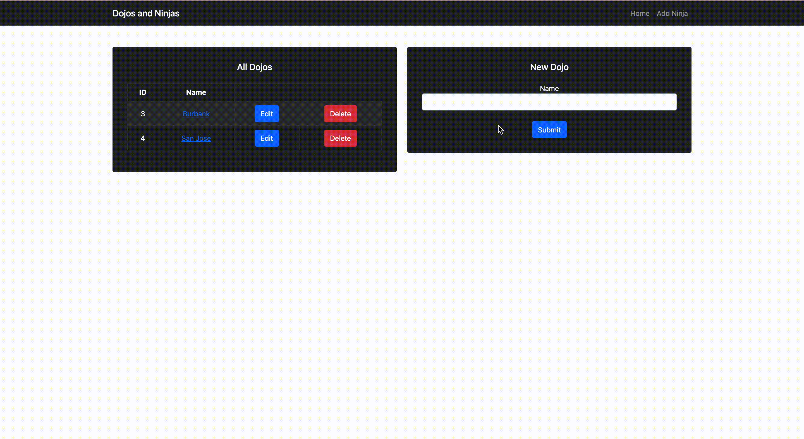

# Dojos and Ninjas
## One-to-Many Spring CRUD App

### Key Features:
- Create, Read, Update and Delete Dojos
- Ability to delete parent (dojo) and it's children elements (ninjas)
- Bootstrap UI
- Connected to SQL database

